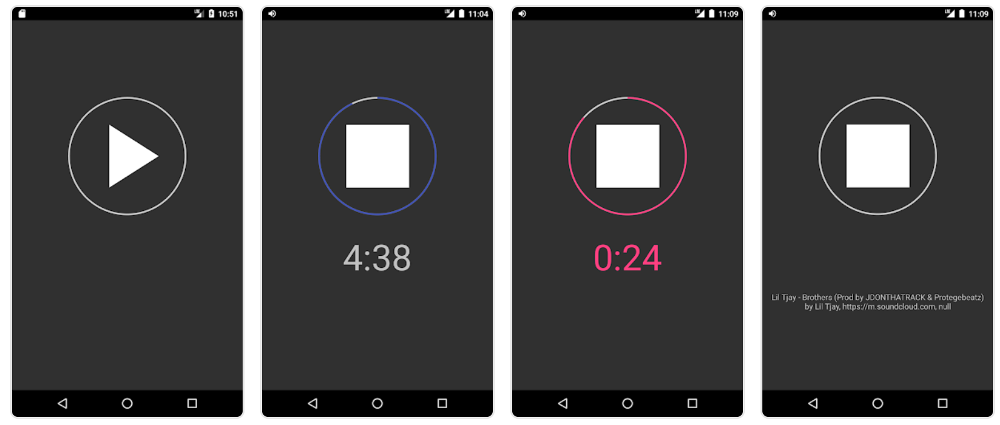

# Active Sleep Timer

Sleep Timer is an intuitive Android application crafted to enrich your audio experience by smartly pausing your music or audiobook when no movement is detected, indicating you might have fallen asleep. It's an ideal solution for those who love drifting off to music or stories but prefer not to leave their audio playing all night. This feature is exceptionally beneficial for audiobook listeners, ensuring you never lose your place as the last chapter or song is automatically saved.

[View App in Google Play Store](https://play.google.com/store/apps/details?id=de.buckwich.sleeptimer)

## Usage

- Simply activate the timer, and you'll have the option to extend it by moving within the first 5 minutes. Typically, your natural movements before falling asleep will suffice to extend the timer.
- If no movement is detected, the audio will pause after the 5-minute mark, and your last listened chapter or song will be saved.
- The app interfaces with the media notification API to manage audio playback, supporting most audio players (e.g., Audible, Spotify, YouTube Music). Note that special permission is required to control the audio player in newer Android Versions (SDK version > 21).
